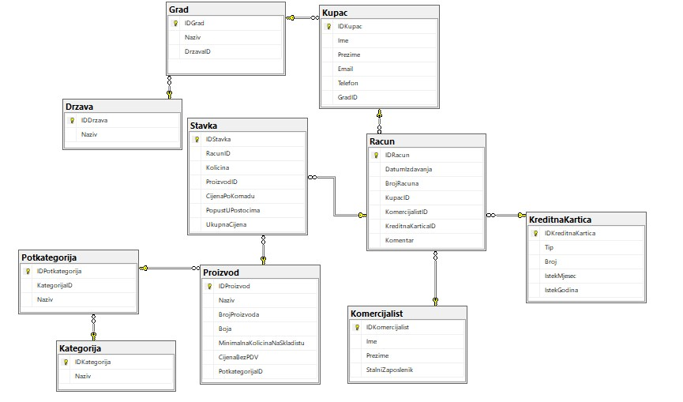

#  AdventureWorks Analytics 

## 📝 Project Overview & Origin

The data used in this project originates from the **Microsoft AdventureWorks database**, a standard sample dataset that simulates the enterprise operations of a large-scale, multinational manufacturing company (**Adventure Works Cycles**). 

The database encompasses complex business scenarios. For the purpose of this project, a customized, localized schema was utilized to focus strictly on **B2C (Business-to-Consumer) sales analytics, customer demographics, and regional order distributions**.

## 💼 Business Context & Objectives

Adventure Works Cycles sells products globally. To drive executive decision-making, this project applies relational database principles to extract actionable insights from the transactional ledger. The analytical workloads are split into three logical phases:

1. **Data Discovery (`01_adventureworks_selections.sql`):** Initial data exploration, tracking high-value items, and filtering key customer attributes.
2. **Relational Analysis (`02_adventureworks_joins.sql`):** Deep queries traversing from the top-level product categories down through localized cities (`Grad`) and individual customer accounts (`Kupac`) to pinpoint buying patterns and inactive markets.
3. **Data Manipulation & Integrity (`03_adventureworks_dml.sql`):** Executing critical structural changes, archiving data into runtime tables (`SELECT INTO`), and handling strict relational boundaries (`Foreign Key Constraints`) during cascade delete operations.

## 📊 Database ER Diagram

The following diagram illustrates the relational layout of the localized schema.

## 📂 Project Navigation

To maintain a clean repository architecture, the source code and documentation have been separated:

* 📁 **[Scripts](scripts/)** - Folder containing the database initialization script (`00_init_db.sql`) and the complete partitioned SQL analytical code (`selections`, `joins`, and `dml`).
* 📖 **[Data Dictionary](adventureworks_data_dictionary.md)** - Full structural reference detailing table definitions, localized Croatian-to-English column mappings, and constraints.

## 🔗 References & Official Documentation

* **Microsoft AdventureWorks Installation & Configuration:** [Official Microsoft Learn Documentation](https://learn.microsoft.com/en-us/sql/samples/adventureworks-install-configure?view=sql-server-ver17&tabs=ssms)
* **Database Engine:** Microsoft SQL Server (Transact-SQL / T-SQL)